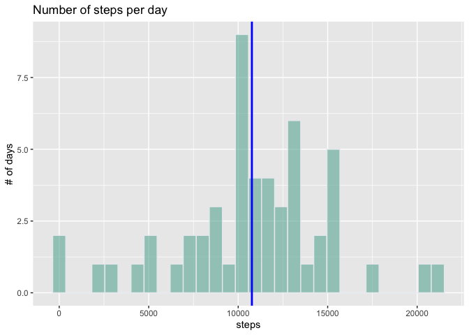
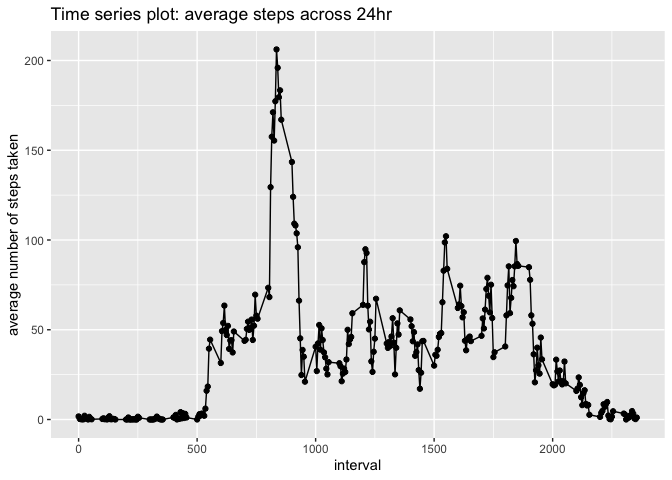
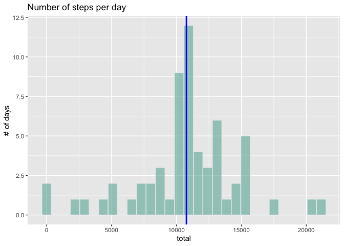
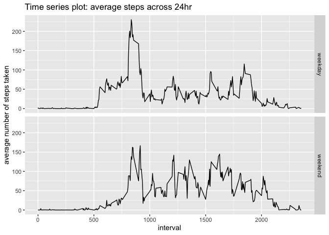

```r
library(knitr)
opts_knit$set(root.dir="/Users/sisihe/Desktop/Sisi_Personal/Course/Coursera/DataScientist/Reproducible/RepData_PeerAssessment1/")
opts_chunk$set(message=FALSE)
```

## Loading and preprocessing the data


```r
activity<-read.csv("activity.csv")
activity$date<-as.Date(activity$date,"%Y-%m-%d")
```

## What is mean total number of steps taken per day?

- Calculate the total number of steps taken per day

```r
total<-tapply(activity$steps,activity$date,sum)
total<-data.frame(date=as.Date(names(total),"%Y-%m-%d"),steps=as.numeric(total))
head(total)
```

```
##         date steps
## 1 2012-10-01    NA
## 2 2012-10-02   126
## 3 2012-10-03 11352
## 4 2012-10-04 12116
## 5 2012-10-05 13294
## 6 2012-10-06 15420
```

- Make a histogram of the total number of steps taken each day (blue line represents mean total number of steps taken per day)

```r
library(ggplot2)
library(dplyr)

p <- total %>% ggplot(aes(x=steps)) + geom_histogram(color="#e9ecef",fill="#69b3a2",alpha=0.6) + ggtitle("Number of steps per day") + ylab("# of days") 

p + geom_vline(aes(xintercept=mean(steps,na.rm=T)),color="blue",size=1)
```

```
## Warning: Removed 8 rows containing non-finite values (stat_bin).
```

<!-- -->

- Report the mean and median of the total number of steps taken per day

```r
report<-data.frame(mean=mean(total$steps,na.rm=T), median=median(total$steps,na.rm=T))
report
```

```
##       mean median
## 1 10766.19  10765
```

## What is the average daily activity pattern?

- Make a time series plot (i.e. \color{red}{\verb|type = "l"|}type="l") of the 5-minute interval (x-axis) and the average number of steps taken, averaged across all days (y-axis)

```r
avg<-tapply(activity$steps,activity$interval,mean,na.rm=T)
avg<-as.data.frame(avg)
avg$interval<-as.numeric(rownames(avg))
ggplot(avg,aes(x=interval,y=avg))+geom_point()+geom_line()+ylab("average number of steps taken")+ggtitle("Time series plot: average steps across 24hr")
```

<!-- -->

- Which 5-minute interval, on average across all the days in the dataset, contains the maximum number of steps?

```r
max_step<-avg[avg$avg==max(avg$avg),]
colnames(max_step)<-c("Average Steps","Interval")
max_step
```

```
##     Average Steps Interval
## 835      206.1698      835
```

## Imputing missing values

- Calculate and report the total number of missing values in the dataset (i.e. the total number of rows with \color{red}{\verb|NA|}NAs)


```r
sum(is.na(activity))
```

```
## [1] 2304
```

- Devise a strategy for filling in all of the missing values in the dataset: fill missing values with mean for the 5-min interval
- Create a new dataset that is equal to the original dataset but with the missing data filled in.

```r
missing<- activity %>% filter(complete.cases(steps)!=TRUE)
for (i in 1:2304){
        interval<-missing[i,]$interval
        avg_step<-avg[avg$interval==interval,]$avg
        missing[i,]$steps<-avg_step
}

activity2<-activity
activity2[complete.cases(activity2$steps)!=TRUE,]<-missing
```

- Make a histogram of the total number of steps taken each day

```r
total_step<-as.data.frame(tapply(activity2$steps,activity2$date,sum))
total_step$date<-as.Date(rownames(total_step),"%Y-%m-%d")
colnames(total_step)<-c("total","date")

p <- total_step %>% ggplot(aes(x=total)) + geom_histogram(color="#e9ecef",fill="#69b3a2",alpha=0.6) + ggtitle("Number of steps per day") + ylab("# of days") 

p + geom_vline(aes(xintercept=mean(total,na.rm=T)),color="blue",size=1)
```

<!-- -->

- Calculate and report the mean and median total number of steps taken per day. 
- Do these values differ from the estimates from the first part of the assignment? What is the impact of imputing missing data on the estimates of the total daily number of steps? (Yes, it changes the median)


```r
report2<-data.frame(mean=mean(total_step$total), median=median(total_step$total))
report2
```

```
##       mean   median
## 1 10766.19 10766.19
```

## Are there differences in activity patterns between weekdays and weekends?

- Create a new factor variable in the dataset with two levels – “weekday” and “weekend” indicating whether a given date is a weekday or weekend day.

```r
activity2$weekday<-weekdays(activity2$date)
activity2$weekday_F<-ifelse(activity2$weekday %in% c("Saturday","Sunday"),"weekend","weekday")
```

-Make a panel plot containing a time series plot (i.e. \color{red}{\verb|type = "l"|}type="l") of the 5-minute interval (x-axis) and the average number of steps taken, averaged across all weekday days or weekend days (y-axis).


```r
avg_weekday<-activity2 %>% group_by(weekday_F,interval) %>% summarize(avg=mean(steps))
avg_weekday$weekday_F<-as.factor(avg_weekday$weekday_F)

ggplot(avg_weekday,aes(x=interval,y=avg))+facet_grid(weekday_F ~ .) + geom_line()+ylab("average number of steps taken")+ggtitle("Time series plot: average steps across 24hr")
```

<!-- -->
